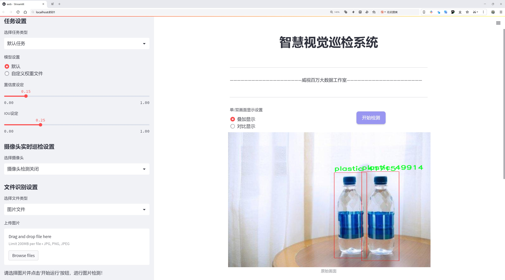
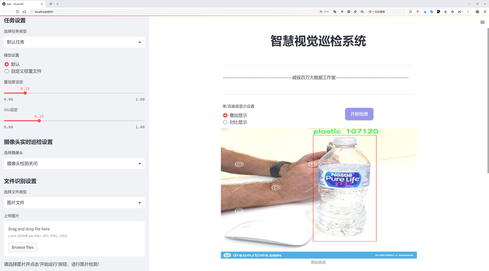
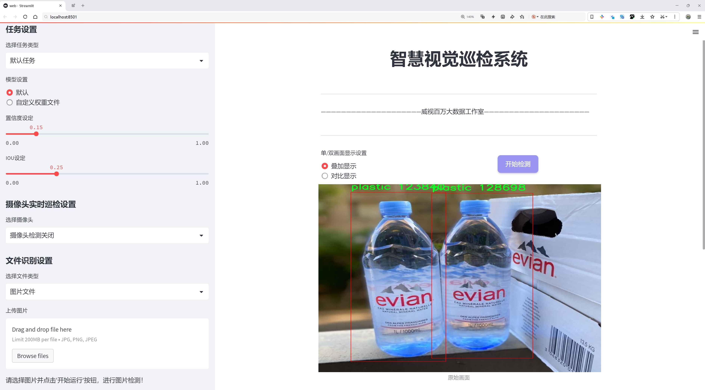
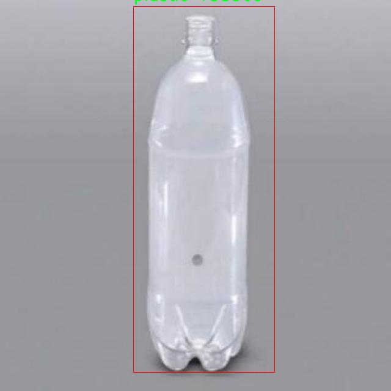
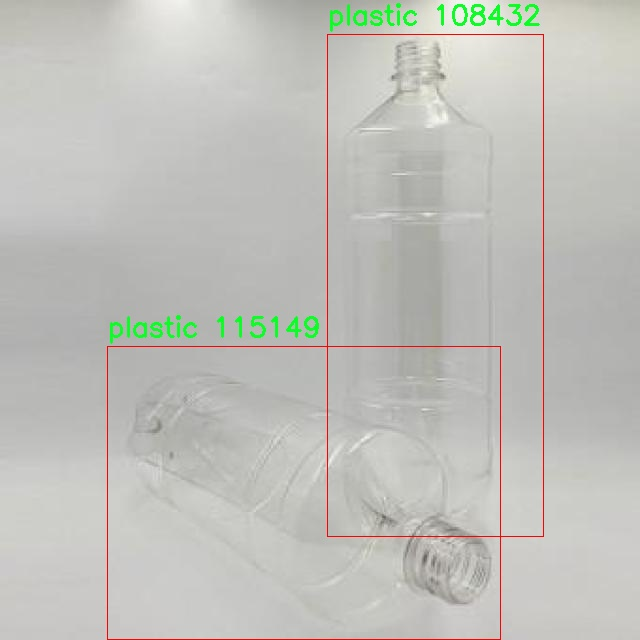
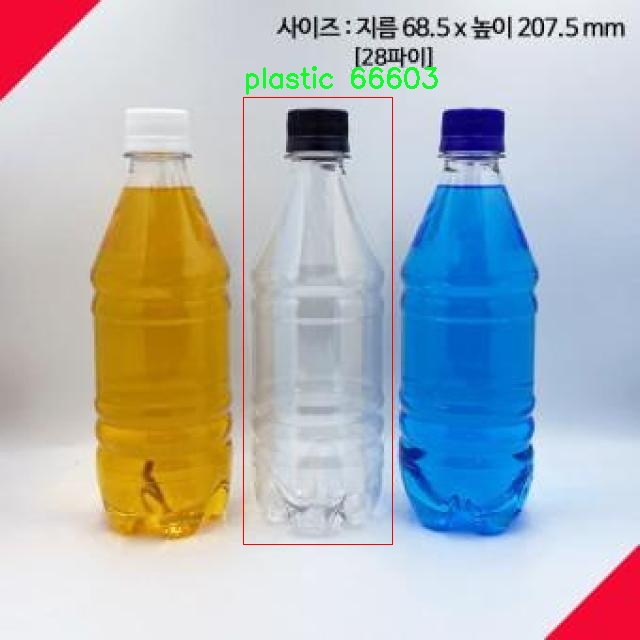
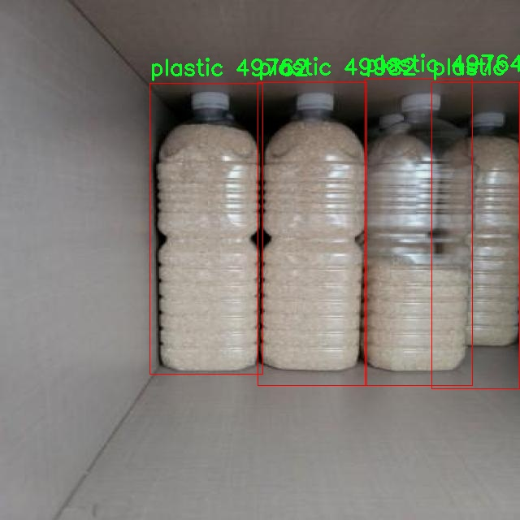
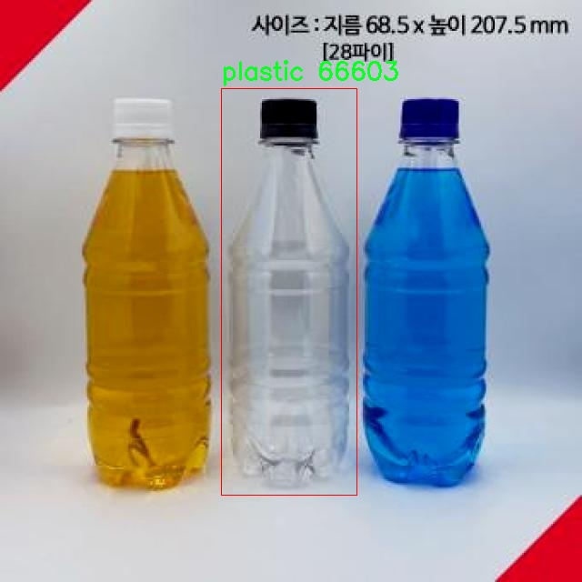

# 瓶子类型检测检测系统源码分享
 # [一条龙教学YOLOV8标注好的数据集一键训练_70+全套改进创新点发刊_Web前端展示]

### 1.研究背景与意义

项目参考[AAAI Association for the Advancement of Artificial Intelligence](https://gitee.com/qunmasj/projects)

项目来源[AACV Association for the Advancement of Computer Vision](https://kdocs.cn/l/cszuIiCKVNis)

研究背景与意义

随着社会经济的快速发展和人们生活水平的提高，塑料瓶、饮料瓶等各类瓶子在日常生活中愈发普遍。这些瓶子不仅在消费品行业中占据重要地位，而且在环境保护、资源回收等领域也引发了广泛关注。根据统计数据，全球每年产生的塑料废弃物中，瓶子类塑料占据了相当大的比例，给环境带来了巨大的压力。因此，如何有效地识别和分类不同类型的瓶子，成为了当前环境保护和资源回收领域亟待解决的问题。

在这一背景下，计算机视觉技术的迅猛发展为瓶子类型检测提供了新的解决方案。尤其是基于深度学习的目标检测算法，如YOLO（You Only Look Once），因其高效性和准确性，逐渐成为目标检测领域的主流方法。YOLOv8作为YOLO系列的最新版本，具备了更强的特征提取能力和更快的推理速度，能够在复杂环境中实现实时目标检测。因此，基于改进YOLOv8的瓶子类型检测系统的研究，不仅具有重要的学术价值，也对实际应用具有深远的意义。

本研究所使用的数据集包含1600张图像，涵盖了5个类别，具体包括瓶子、塑料瓶、T瓶和水瓶等39个类目。这一数据集的多样性和丰富性为模型的训练和测试提供了良好的基础。通过对这些数据的深入分析与处理，可以有效提升模型在不同瓶子类型识别中的准确性和鲁棒性。此外，数据集中对瓶子类型的细分，有助于模型学习到不同瓶子在形状、颜色、材质等方面的特征，从而实现更为精确的分类。

在环境保护和资源回收的背景下，基于改进YOLOv8的瓶子类型检测系统的研究，具有重要的社会意义。该系统的应用可以有效提升瓶子回收的效率，促进资源的循环利用，降低环境污染。同时，通过对瓶子类型的精准识别，可以为相关企业提供数据支持，帮助其优化生产流程和产品设计，推动可持续发展。

此外，本研究还具有重要的学术意义。通过对YOLOv8模型的改进与优化，可以为目标检测领域提供新的思路和方法，推动深度学习技术在图像识别中的应用。同时，研究中所提出的改进策略和实验结果，能够为后续相关研究提供参考，推动该领域的进一步发展。

综上所述，基于改进YOLOv8的瓶子类型检测系统的研究，不仅在技术上具有创新性和实用性，更在环境保护和资源回收的实际应用中展现出重要的社会价值。通过这一研究，期望能够为解决瓶子类型识别及其相关问题提供有效的技术支持，推动可持续发展的进程。

### 2.图片演示







##### 注意：由于此博客编辑较早，上面“2.图片演示”和“3.视频演示”展示的系统图片或者视频可能为老版本，新版本在老版本的基础上升级如下：（实际效果以升级的新版本为准）

  （1）适配了YOLOV8的“目标检测”模型和“实例分割”模型，通过加载相应的权重（.pt）文件即可自适应加载模型。

  （2）支持“图片识别”、“视频识别”、“摄像头实时识别”三种识别模式。

  （3）支持“图片识别”、“视频识别”、“摄像头实时识别”三种识别结果保存导出，解决手动导出（容易卡顿出现爆内存）存在的问题，识别完自动保存结果并导出到tempDir中。

  （4）支持Web前端系统中的标题、背景图等自定义修改，后面提供修改教程。

  另外本项目提供训练的数据集和训练教程,暂不提供权重文件（best.pt）,需要您按照教程进行训练后实现图片演示和Web前端界面演示的效果。

### 3.视频演示

[3.1 视频演示](https://www.bilibili.com/video/BV1nExPeqE14/)

### 4.数据集信息展示

##### 4.1 本项目数据集详细数据（类别数＆类别名）

nc: 5
names: ['39', 'bottle', 'plastic', 't_bottle', 'waterbottle']


##### 4.2 本项目数据集信息介绍

数据集信息展示

在现代计算机视觉领域，物体检测技术的进步依赖于高质量的数据集。为改进YOLOv8的瓶子类型检测系统，我们选用了名为“yadhukrishna”的数据集。该数据集专注于多种瓶子类型的识别，涵盖了五个主要类别，分别为“39”、“bottle”、“plastic”、“t_bottle”和“waterbottle”。这些类别的选择不仅反映了瓶子在日常生活中的多样性，也为训练模型提供了丰富的样本和多样的场景。

“yadhukrishna”数据集的设计旨在满足深度学习模型对数据多样性的需求。每个类别都包含了大量的标注图像，这些图像在不同的背景、光照条件和视角下拍摄，确保了模型在实际应用中的鲁棒性。例如，类别“bottle”涵盖了各种形状和材质的瓶子，而“plastic”则专注于塑料瓶的识别，进一步细分了模型的检测能力。类别“t_bottle”可能指的是特定形状的瓶子，而“waterbottle”则专注于水瓶的识别，体现了数据集的细致划分。

数据集中的图像不仅包含了瓶子的正面视图，还包括侧面和背面的视角，这样的多样性使得模型能够更好地学习到瓶子的特征，从而提高检测的准确性。此外，数据集中还包含了不同环境下的瓶子图像，例如户外、室内、超市货架等场景，这种场景的多样性为模型在实际应用中提供了更广泛的适应性。

在数据集的构建过程中，所有图像均经过严格的标注，确保每个瓶子都被准确地框定和分类。这种高质量的标注是训练高效物体检测模型的基础。通过使用“yadhukrishna”数据集，我们的目标是使YOLOv8能够更精准地识别和分类不同类型的瓶子，从而在实际应用中实现更高的效率和准确性。

此外，数据集的类别数量为五，虽然看似不多，但每个类别的细致划分使得模型在处理复杂场景时，能够更好地进行区分。例如，在一个混合了多种瓶子的场景中，模型能够通过学习到的特征，快速识别出每种瓶子的类型，从而为后续的处理提供支持。这种细致的分类不仅提升了模型的检测能力，也为后续的瓶子回收、分类和管理提供了数据支持。

综上所述，“yadhukrishna”数据集为改进YOLOv8的瓶子类型检测系统提供了丰富的资源和坚实的基础。通过对多样化图像的学习，模型将能够在实际应用中展现出卓越的性能，满足日益增长的物体检测需求。数据集的设计理念和结构，为研究人员和开发者提供了一个良好的起点，以推动瓶子类型检测技术的进一步发展。











### 5.全套项目环境部署视频教程（零基础手把手教学）

[5.1 环境部署教程链接（零基础手把手教学）](https://www.ixigua.com/7404473917358506534?logTag=c807d0cbc21c0ef59de5)


[5.2 安装Python虚拟环境创建和依赖库安装视频教程链接（零基础手把手教学）](https://www.ixigua.com/7404474678003106304?logTag=1f1041108cd1f708b01a)

### 6.手把手YOLOV8训练视频教程（零基础小白有手就能学会）

[6.1 手把手YOLOV8训练视频教程（零基础小白有手就能学会）](https://www.ixigua.com/7404477157818401292?logTag=d31a2dfd1983c9668658)

### 7.70+种全套YOLOV8创新点代码加载调参视频教程（一键加载写好的改进模型的配置文件）

[7.1 70+种全套YOLOV8创新点代码加载调参视频教程（一键加载写好的改进模型的配置文件）](https://www.ixigua.com/7404478314661806627?logTag=29066f8288e3f4eea3a4)

### 8.70+种全套YOLOV8创新点原理讲解（非科班也可以轻松写刊发刊，V10版本正在科研待更新）

由于篇幅限制，每个创新点的具体原理讲解就不一一展开，具体见下列网址中的创新点对应子项目的技术原理博客网址【Blog】：


[8.1 70+种全套YOLOV8创新点原理讲解链接](https://gitee.com/qunmasj/good)

### 9.系统功能展示（检测对象为举例，实际内容以本项目数据集为准）

图9.1.系统支持检测结果表格显示

  图9.2.系统支持置信度和IOU阈值手动调节

  图9.3.系统支持自定义加载权重文件best.pt(需要你通过步骤5中训练获得)

  图9.4.系统支持摄像头实时识别

  图9.5.系统支持图片识别

  图9.6.系统支持视频识别

  图9.7.系统支持识别结果文件自动保存

  图9.8.系统支持Excel导出检测结果数据


### 10.原始YOLOV8算法原理

原始YOLOv8算法原理

YOLOv8是2023年1月由Ultralytics发布的一款前沿目标检测模型，其设计理念源于对之前YOLO系列算法的深刻理解与创新，特别是结合了YOLOX、YOLOv6、YOLOv7和PPYOLOE等多种算法的优点，形成了一种高效且灵活的检测框架。YOLOv8不仅在精度和速度上达到了新的高度，还在结构设计上进行了多项创新，旨在满足现代计算机视觉应用日益增长的需求。

YOLOv8的整体架构由输入层、主干网络、颈部网络和头部网络四个主要部分构成。输入层负责将原始图像进行缩放处理，以适应模型的输入要求。主干网络则通过一系列卷积操作对图像进行特征提取。每个卷积层都包含批归一化和SiLU激活函数，这样的设计使得网络在训练过程中能够更好地学习到有效的特征表示。值得注意的是，YOLOv8引入了C2f模块，这一模块的设计灵感来源于YOLOv7中的E-ELAN结构，通过跨层分支连接，显著增强了模型的梯度流动，从而提高了检测性能。

在特征提取的过程中，YOLOv8采用了PAN-FPN结构来实现多尺度特征的融合。该结构通过自下而上的路径和自上而下的路径结合，确保了不同尺度特征的有效传递。特别是在主干网络的末尾，YOLOv8引入了SPPFl模块，该模块通过三个最大池化层处理多尺度特征，进一步增强了网络的特征抽象能力，使得模型在面对复杂场景时依然能够保持较高的检测精度。

YOLOv8的头部网络采用了解耦合的检测头结构，将分类和回归任务分开处理。通过两个并行的卷积分支，模型能够独立计算回归和类别的损失，这种设计不仅提高了计算效率，还减少了任务之间的干扰。此外，YOLOv8摒弃了传统的Anchor-Based方法，转而采用Anchor-Free的策略，这一创新使得模型在处理目标检测时更加灵活，能够适应多种不同的目标形状和大小。

在训练过程中，YOLOv8也进行了多项数据增强策略的优化。例如，在训练的最后10个epoch中，模型关闭了马赛克增强，并采用了动态Task-Aligned Assigner样本分配策略。这种方法通过动态调整样本的分配，使得模型在训练过程中能够更好地适应不同的目标检测任务，从而提高了整体的检测性能。

在损失计算方面，YOLOv8使用了BCELoss作为分类损失，DFLLoss和CIoULoss作为回归损失。这种损失函数的选择使得模型在分类和回归任务上都能够获得更好的优化效果，进一步提升了检测精度。

YOLOv8的模型规模也十分灵活，提供了n、s、m、l、x共五种不同尺度的模型，用户可以根据具体应用场景的需求选择合适的模型。这种灵活性使得YOLOv8能够在各种设备上运行，从高性能的服务器到资源受限的边缘设备，都能实现实时目标检测。

在实际应用中，YOLOv8的高效性和准确性使其在多个领域展现出巨大的潜力。例如，在农业领域，YOLOv8被应用于苹果采摘的自动化过程中，利用其强大的视觉识别能力，能够快速检测和定位苹果。这一应用不仅提高了采摘效率，还降低了人工成本，为农业生产带来了新的变革。

总的来说，YOLOv8作为YOLO系列的最新版本，集成了多种先进的设计理念和技术创新，充分展现了其在目标检测领域的强大能力。通过不断优化网络结构、改进训练策略和灵活调整模型规模，YOLOv8不仅在精度和速度上达到了新的高度，更为未来的计算机视觉应用提供了广阔的可能性。随着YOLOv8的广泛应用，目标检测技术必将在各个行业中发挥越来越重要的作用，推动智能化进程的加速。


### 11.项目核心源码讲解（再也不用担心看不懂代码逻辑）

#### 11.1 70+种YOLOv8算法改进源码大全和调试加载训练教程（非必要）\ultralytics\engine\exporter.py

以下是对代码的核心部分进行的简化和详细中文注释。代码的主要功能是将YOLOv8模型导出为多种格式，包括PyTorch、ONNX、TensorFlow等。

```python
import json
import os
import shutil
import subprocess
import time
import warnings
from copy import deepcopy
from datetime import datetime
from pathlib import Path
import torch
from ultralytics.cfg import get_cfg
from ultralytics.utils import LOGGER, __version__, yaml_save
from ultralytics.utils.torch_utils import select_device

class Exporter:
    """
    导出模型的类。

    属性:
        args (SimpleNamespace): 导出器的配置。
        callbacks (list, optional): 回调函数列表。默认为None。
    """

    def __init__(self, cfg='default_cfg.yaml', overrides=None, _callbacks=None):
        """
        初始化Exporter类。

        参数:
            cfg (str, optional): 配置文件的路径。默认为'default_cfg.yaml'。
            overrides (dict, optional): 配置覆盖。默认为None。
            _callbacks (dict, optional): 回调函数的字典。默认为None。
        """
        self.args = get_cfg(cfg, overrides)  # 获取配置
        self.callbacks = _callbacks or []  # 初始化回调函数

    def __call__(self, model=None):
        """运行导出过程并返回导出文件/目录的列表。"""
        self.run_callbacks('on_export_start')  # 运行导出开始的回调
        t = time.time()  # 记录开始时间

        # 选择设备
        self.device = select_device('cpu' if self.args.device is None else self.args.device)

        # 检查模型类名
        model.names = check_class_names(model.names)

        # 准备输入张量
        im = torch.zeros(self.args.batch, 3, *self.args.imgsz).to(self.device)

        # 深拷贝模型并设置为评估模式
        model = deepcopy(model).to(self.device)
        model.eval()

        # 导出模型
        f = self.export_onnx(model, im)  # 导出为ONNX格式

        # 完成导出
        self.run_callbacks('on_export_end')  # 运行导出结束的回调
        return f  # 返回导出的文件路径

    def export_onnx(self, model, im):
        """导出为ONNX格式的函数。"""
        f = Path('model.onnx')  # 设置导出文件名
        torch.onnx.export(
            model.cpu(),  # 将模型移到CPU
            im.cpu(),  # 将输入移到CPU
            f,  # 导出文件路径
            input_names=['images'],  # 输入名称
            output_names=['output0'],  # 输出名称
            dynamic_axes={'images': {0: 'batch', 2: 'height', 3: 'width'}}  # 动态轴
        )
        return f  # 返回导出文件路径

    def run_callbacks(self, event: str):
        """执行给定事件的所有回调。"""
        for callback in self.callbacks.get(event, []):
            callback(self)  # 运行每个回调函数

# 使用示例
# exporter = Exporter(cfg='config.yaml')
# exported_file = exporter(model)
```

### 代码说明：
1. **类`Exporter`**：用于导出YOLOv8模型的类，包含了初始化和导出功能。
2. **`__init__`方法**：初始化时获取配置，并设置回调函数。
3. **`__call__`方法**：运行导出过程，选择设备，准备输入张量，调用导出函数，并返回导出文件路径。
4. **`export_onnx`方法**：将模型导出为ONNX格式，使用`torch.onnx.export`进行导出。
5. **`run_callbacks`方法**：执行指定事件的回调函数。

此代码片段保留了导出模型的核心逻辑，并提供了详细的中文注释以帮助理解每个部分的功能。

这个文件是YOLOv8模型导出工具的实现代码，主要用于将训练好的YOLOv8模型导出为多种格式，以便在不同的平台和框架中使用。代码中详细列出了支持的导出格式，包括PyTorch、TorchScript、ONNX、OpenVINO、TensorRT、CoreML、TensorFlow等。每种格式的导出都对应着不同的函数和处理逻辑。

文件开头部分是一些文档字符串，介绍了导出功能的基本信息和使用方法，包括通过Python代码或命令行接口（CLI）进行模型导出的示例。接着，代码中导入了一些必要的库和模块，包括PyTorch、NumPy、以及Ultralytics库中的各种工具和模型组件。

`export_formats`函数定义了支持的导出格式，并返回一个包含格式信息的DataFrame。`gd_outputs`函数用于获取TensorFlow GraphDef模型的输出节点名称。

`try_export`是一个装饰器，用于包装导出函数，以便在导出过程中捕获异常并记录日志。`Exporter`类是核心类，负责处理模型的导出逻辑。它的构造函数接受配置参数，并初始化回调函数。`__call__`方法是导出过程的主要入口，负责根据用户指定的格式导出模型，并进行必要的检查和准备工作。

在导出过程中，代码会根据指定的格式调用相应的导出函数，例如`export_torchscript`、`export_onnx`、`export_openvino`等。这些函数实现了具体的导出逻辑，包括模型的转换、优化和保存等步骤。每个导出函数都包含详细的日志记录，以便跟踪导出过程中的状态和结果。

文件中还包含了一些用于处理特定格式的辅助函数，例如为TensorFlow Lite模型添加元数据、处理CoreML模型的管道等。整个代码结构清晰，逻辑严谨，便于后续的扩展和维护。

总的来说，这个文件实现了YOLOv8模型的多格式导出功能，使得用户可以方便地将训练好的模型应用于不同的环境和框架中。

#### 11.2 ui.py

```python
import sys
import subprocess

def run_script(script_path):
    """
    使用当前 Python 环境运行指定的脚本。

    Args:
        script_path (str): 要运行的脚本路径

    Returns:
        None
    """
    # 获取当前 Python 解释器的路径
    python_path = sys.executable

    # 构建运行命令
    command = f'"{python_path}" -m streamlit run "{script_path}"'

    # 执行命令
    result = subprocess.run(command, shell=True)
    if result.returncode != 0:
        print("脚本运行出错。")


# 实例化并运行应用
if __name__ == "__main__":
    # 指定您的脚本路径
    script_path = "web.py"  # 这里可以直接指定脚本路径

    # 运行脚本
    run_script(script_path)
```

### 代码注释说明：

1. **导入模块**：
   - `import sys`：导入 sys 模块以访问与 Python 解释器和环境相关的变量和函数。
   - `import subprocess`：导入 subprocess 模块以便能够执行外部命令。

2. **定义函数 `run_script`**：
   - 该函数接收一个参数 `script_path`，表示要运行的 Python 脚本的路径。
   - 函数内部首先获取当前 Python 解释器的路径，以便使用正确的解释器来运行脚本。

3. **构建命令**：
   - 使用 f-string 格式化字符串构建运行命令，命令格式为：`python -m streamlit run <script_path>`，这将通过 Streamlit 运行指定的脚本。

4. **执行命令**：
   - 使用 `subprocess.run` 执行构建的命令，`shell=True` 允许在 shell 中执行命令。
   - 检查命令的返回码，如果返回码不为 0，表示脚本运行出错，打印错误信息。

5. **主程序入口**：
   - `if __name__ == "__main__":`：确保只有在直接运行该脚本时才会执行以下代码。
   - 指定要运行的脚本路径为 `web.py`。
   - 调用 `run_script` 函数来运行指定的脚本。

这个程序文件名为 `ui.py`，主要功能是通过当前的 Python 环境来运行一个指定的脚本。程序的实现依赖于 Python 的标准库，包括 `sys`、`os` 和 `subprocess`，同时还引入了一个自定义模块 `QtFusion.path` 中的 `abs_path` 函数，用于获取脚本的绝对路径。

在程序的开头，首先导入了所需的模块。接着定义了一个名为 `run_script` 的函数，该函数接受一个参数 `script_path`，表示要运行的脚本的路径。函数内部首先获取当前 Python 解释器的路径，然后构建一个命令字符串，该命令用于调用 `streamlit` 来运行指定的脚本。`streamlit` 是一个用于构建数据应用的框架。

接下来，使用 `subprocess.run` 方法执行构建好的命令。如果命令执行的返回码不为零，表示脚本运行过程中出现了错误，此时会打印出一条错误信息。

在文件的最后部分，使用 `if __name__ == "__main__":` 语句来确保当该文件作为主程序运行时，才会执行以下代码。这里指定了要运行的脚本路径，调用 `abs_path` 函数获取 `web.py` 的绝对路径，并最终调用 `run_script` 函数来执行这个脚本。

总体来说，这个程序的主要目的是提供一个简单的接口来运行一个名为 `web.py` 的脚本，方便用户在当前的 Python 环境中启动相应的应用。

#### 11.3 code\ultralytics\data\explorer\utils.py

以下是代码中最核心的部分，并附上详细的中文注释：

```python
import cv2
import numpy as np
from ultralytics.data.augment import LetterBox
from ultralytics.utils.ops import xyxy2xywh
from ultralytics.utils.plotting import plot_images

def sanitize_batch(batch, dataset_info):
    """对输入批次进行清理，确保格式和维度正确。"""
    # 将类别信息展平并转换为整数列表
    batch["cls"] = batch["cls"].flatten().int().tolist()
    
    # 根据类别对边界框和类别进行排序
    box_cls_pair = sorted(zip(batch["bboxes"].tolist(), batch["cls"]), key=lambda x: x[1])
    batch["bboxes"] = [box for box, _ in box_cls_pair]  # 提取排序后的边界框
    batch["cls"] = [cls for _, cls in box_cls_pair]      # 提取排序后的类别
    batch["labels"] = [dataset_info["names"][i] for i in batch["cls"]]  # 获取标签名称
    # 如果没有掩膜，则初始化为空列表
    batch["masks"] = batch["masks"].tolist() if "masks" in batch else [[[]]]
    # 如果没有关键点，则初始化为空列表
    batch["keypoints"] = batch["keypoints"].tolist() if "keypoints" in batch else [[[]]]
    return batch

def plot_query_result(similar_set, plot_labels=True):
    """
    绘制来自相似集合的图像。

    参数:
        similar_set (list): 包含相似数据点的Pyarrow或pandas对象
        plot_labels (bool): 是否绘制标签
    """
    # 将相似集合转换为字典格式
    similar_set = (
        similar_set.to_dict(orient="list") if isinstance(similar_set, pd.DataFrame) else similar_set.to_pydict()
    )
    
    # 初始化变量
    images = similar_set.get("im_file", [])
    bboxes = similar_set.get("bboxes", [])
    masks = similar_set.get("masks", [[[]]])
    kpts = similar_set.get("keypoints", [[[]]])
    cls = similar_set.get("cls", [])

    plot_size = 640  # 设置绘图大小
    imgs, batch_idx, plot_boxes, plot_masks, plot_kpts = [], [], [], [], []
    
    for i, imf in enumerate(images):
        im = cv2.imread(imf)  # 读取图像
        im = cv2.cvtColor(im, cv2.COLOR_BGR2RGB)  # 转换颜色格式
        h, w = im.shape[:2]  # 获取图像的高度和宽度
        r = min(plot_size / h, plot_size / w)  # 计算缩放比例
        imgs.append(LetterBox(plot_size, center=False)(image=im).transpose(2, 0, 1))  # 调整图像大小
        
        if plot_labels:
            # 绘制边界框
            if len(bboxes) > i and len(bboxes[i]) > 0:
                box = np.array(bboxes[i], dtype=np.float32)
                box[:, [0, 2]] *= r  # 调整边界框的x坐标
                box[:, [1, 3]] *= r  # 调整边界框的y坐标
                plot_boxes.append(box)
            # 绘制掩膜
            if len(masks) > i and len(masks[i]) > 0:
                mask = np.array(masks[i], dtype=np.uint8)[0]
                plot_masks.append(LetterBox(plot_size, center=False)(image=mask))
            # 绘制关键点
            if len(kpts) > i and kpts[i] is not None:
                kpt = np.array(kpts[i], dtype=np.float32)
                kpt[:, :, :2] *= r  # 调整关键点坐标
                plot_kpts.append(kpt)
        batch_idx.append(np.ones(len(np.array(bboxes[i], dtype=np.float32))) * i)  # 记录批次索引
    
    # 将所有图像、掩膜、关键点和边界框堆叠成数组
    imgs = np.stack(imgs, axis=0)
    masks = np.stack(plot_masks, axis=0) if plot_masks else np.zeros(0, dtype=np.uint8)
    kpts = np.concatenate(plot_kpts, axis=0) if plot_kpts else np.zeros((0, 51), dtype=np.float32)
    boxes = xyxy2xywh(np.concatenate(plot_boxes, axis=0)) if plot_boxes else np.zeros(0, dtype=np.float32)
    batch_idx = np.concatenate(batch_idx, axis=0)
    cls = np.concatenate([np.array(c, dtype=np.int32) for c in cls], axis=0)

    # 绘制图像
    return plot_images(
        imgs, batch_idx, cls, bboxes=boxes, masks=masks, kpts=kpts, max_subplots=len(images), save=False, threaded=False
    )
```

### 代码核心部分解释：
1. **sanitize_batch**：该函数负责清理和格式化输入的批次数据，确保其符合后续处理的要求，包括展平类别、排序边界框、提取标签等。

2. **plot_query_result**：该函数用于绘制与查询结果相似的图像。它读取图像、调整大小、绘制边界框、掩膜和关键点，并最终调用 `plot_images` 函数进行可视化。

这个程序文件是一个用于处理和可视化与图像数据相关的工具，主要应用于Ultralytics YOLO（You Only Look Once）目标检测框架。文件中包含多个函数，每个函数都有特定的功能。

首先，文件导入了一些必要的库，包括用于图像处理的OpenCV、NumPy和Pandas，以及Ultralytics框架中的一些模块。文件的开头定义了两个函数，`get_table_schema`和`get_sim_index_schema`，它们分别用于提取数据库表的模式。`get_table_schema`函数定义了一个包含图像文件名、标签、类别、边界框、掩膜、关键点和向量的结构，适用于存储图像数据的表。而`get_sim_index_schema`则定义了一个包含索引、图像文件名、计数和相似图像文件名的结构。

接下来，`sanitize_batch`函数用于清理输入的批处理数据，以确保其格式和维度正确。该函数将类别信息展平并转换为列表，随后根据类别对边界框进行排序，并更新标签、掩膜和关键点的格式。

`plot_query_result`函数的主要功能是从相似数据集中绘制图像。它接收一个包含相似数据点的列表，并可选择性地绘制标签。该函数首先将输入数据转换为字典格式，然后读取图像文件并进行处理，包括调整图像大小和转换颜色通道。接着，它会根据输入的边界框、掩膜和关键点绘制相应的内容，并最终调用`plot_images`函数将所有处理后的图像绘制出来。

最后，`prompt_sql_query`函数用于生成SQL查询。它使用OpenAI的API来生成基于用户请求的SQL查询语句。函数首先检查OpenAI API密钥是否存在，如果不存在，则提示用户输入。然后，它构建一个消息列表，其中包含系统角色的提示信息和用户的查询请求。通过调用OpenAI的聊天接口，函数获取生成的SQL查询并返回。

总体而言，这个文件提供了一系列工具，用于处理图像数据、生成SQL查询以及可视化结果，适用于与YOLO目标检测相关的任务。

#### 11.4 train.py

以下是经过简化并添加详细中文注释的核心代码部分：

```python
import random
import numpy as np
import torch.nn as nn
from ultralytics.data import build_dataloader, build_yolo_dataset
from ultralytics.engine.trainer import BaseTrainer
from ultralytics.models import yolo
from ultralytics.nn.tasks import DetectionModel
from ultralytics.utils import LOGGER, RANK
from ultralytics.utils.torch_utils import de_parallel, torch_distributed_zero_first

class DetectionTrainer(BaseTrainer):
    """
    基于检测模型的训练类，继承自BaseTrainer类。
    """

    def build_dataset(self, img_path, mode="train", batch=None):
        """
        构建YOLO数据集。

        参数:
            img_path (str): 包含图像的文件夹路径。
            mode (str): 模式，`train`表示训练模式，`val`表示验证模式。
            batch (int, optional): 批次大小，仅用于`rect`模式。默认为None。
        """
        gs = max(int(de_parallel(self.model).stride.max() if self.model else 0), 32)  # 获取模型的最大步幅
        return build_yolo_dataset(self.args, img_path, batch, self.data, mode=mode, rect=mode == "val", stride=gs)

    def get_dataloader(self, dataset_path, batch_size=16, rank=0, mode="train"):
        """构造并返回数据加载器。"""
        assert mode in ["train", "val"]  # 确保模式有效
        with torch_distributed_zero_first(rank):  # 在分布式训练中，确保数据集只初始化一次
            dataset = self.build_dataset(dataset_path, mode, batch_size)  # 构建数据集
        shuffle = mode == "train"  # 训练模式下打乱数据
        workers = self.args.workers if mode == "train" else self.args.workers * 2  # 设置工作线程数
        return build_dataloader(dataset, batch_size, workers, shuffle, rank)  # 返回数据加载器

    def preprocess_batch(self, batch):
        """对图像批次进行预处理，包括缩放和转换为浮点数。"""
        batch["img"] = batch["img"].to(self.device, non_blocking=True).float() / 255  # 转换为浮点数并归一化
        if self.args.multi_scale:  # 如果启用多尺度
            imgs = batch["img"]
            sz = (
                random.randrange(self.args.imgsz * 0.5, self.args.imgsz * 1.5 + self.stride)
                // self.stride
                * self.stride
            )  # 随机选择图像大小
            sf = sz / max(imgs.shape[2:])  # 计算缩放因子
            if sf != 1:
                ns = [
                    math.ceil(x * sf / self.stride) * self.stride for x in imgs.shape[2:]
                ]  # 计算新的形状
                imgs = nn.functional.interpolate(imgs, size=ns, mode="bilinear", align_corners=False)  # 进行插值
            batch["img"] = imgs  # 更新批次图像
        return batch

    def get_model(self, cfg=None, weights=None, verbose=True):
        """返回YOLO检测模型。"""
        model = DetectionModel(cfg, nc=self.data["nc"], verbose=verbose and RANK == -1)  # 创建检测模型
        if weights:
            model.load(weights)  # 加载权重
        return model

    def plot_training_samples(self, batch, ni):
        """绘制带有注释的训练样本。"""
        plot_images(
            images=batch["img"],
            batch_idx=batch["batch_idx"],
            cls=batch["cls"].squeeze(-1),
            bboxes=batch["bboxes"],
            paths=batch["im_file"],
            fname=self.save_dir / f"train_batch{ni}.jpg",
            on_plot=self.on_plot,
        )

    def plot_metrics(self):
        """从CSV文件中绘制指标。"""
        plot_results(file=self.csv, on_plot=self.on_plot)  # 保存结果图
```

### 代码说明：
1. **DetectionTrainer类**：该类用于训练YOLO检测模型，继承自基础训练类`BaseTrainer`。
2. **build_dataset方法**：根据给定的图像路径和模式构建YOLO数据集，支持训练和验证模式。
3. **get_dataloader方法**：构造数据加载器，确保在分布式训练中只初始化一次数据集。
4. **preprocess_batch方法**：对输入的图像批次进行预处理，包括归一化和多尺度调整。
5. **get_model方法**：创建并返回YOLO检测模型，支持加载预训练权重。
6. **plot_training_samples方法**：绘制训练样本及其注释，便于可视化训练过程。
7. **plot_metrics方法**：从CSV文件中提取并绘制训练指标，便于监控训练效果。

这个程序文件 `train.py` 是一个用于训练 YOLO（You Only Look Once）目标检测模型的实现，基于 Ultralytics 提供的框架。程序主要包含一个名为 `DetectionTrainer` 的类，继承自 `BaseTrainer`，用于管理和执行训练过程。

在这个类中，首先定义了一个 `build_dataset` 方法，用于构建 YOLO 数据集。该方法接收图像路径、模式（训练或验证）和批次大小作为参数，利用 `build_yolo_dataset` 函数创建数据集。数据集的构建会考虑到模型的步幅（stride），以确保输入图像的尺寸符合模型要求。

接着，`get_dataloader` 方法用于构建数据加载器。它会根据模式（训练或验证）来决定是否打乱数据顺序，并设置工作线程的数量。此方法还利用 `torch_distributed_zero_first` 确保在分布式训练时只初始化一次数据集缓存。

`preprocess_batch` 方法负责对输入的图像批次进行预处理，包括将图像缩放到适当的大小并转换为浮点数格式。该方法还支持多尺度训练，通过随机选择图像尺寸来增强模型的鲁棒性。

`set_model_attributes` 方法用于设置模型的属性，包括类别数量和类别名称等。这些属性会影响模型的训练和推理过程。

`get_model` 方法用于返回一个 YOLO 检测模型实例，并可选择加载预训练权重。`get_validator` 方法则返回一个用于验证模型性能的 `DetectionValidator` 实例，包含损失名称的定义。

在训练过程中，`label_loss_items` 方法用于生成带有标签的损失字典，便于跟踪训练过程中的损失变化。`progress_string` 方法则返回一个格式化的字符串，显示当前训练进度，包括当前轮次、GPU 内存使用情况、损失值、实例数量和图像大小等信息。

此外，`plot_training_samples` 方法用于绘制训练样本及其标注，帮助可视化训练数据的质量。`plot_metrics` 和 `plot_training_labels` 方法则用于绘制训练过程中的指标和标签，分别从 CSV 文件和数据集中提取信息并生成可视化图像。

总体而言，这个程序文件提供了一个完整的训练框架，涵盖了数据集构建、数据加载、模型设置、训练过程监控和结果可视化等多个方面，为使用 YOLO 进行目标检测任务提供了便利。

#### 11.5 code\ultralytics\utils\callbacks\mlflow.py

以下是经过简化和注释的核心代码部分：

```python
# 导入必要的库和模块
from ultralytics.utils import LOGGER, RUNS_DIR, SETTINGS, TESTS_RUNNING, colorstr

try:
    import os
    import mlflow  # 导入mlflow库用于日志记录
    from pathlib import Path

    # 确保在测试运行时不记录日志
    assert not TESTS_RUNNING or "test_mlflow" in os.environ.get("PYTEST_CURRENT_TEST", "")
    # 确保mlflow集成已启用
    assert SETTINGS["mlflow"] is True  
    assert hasattr(mlflow, "__version__")  # 确保mlflow库被正确导入

    # 定义日志前缀和数据清洗函数
    PREFIX = colorstr("MLflow: ")
    SANITIZE = lambda x: {k.replace("(", "").replace(")", ""): float(v) for k, v in x.items()}

except (ImportError, AssertionError):
    mlflow = None  # 如果导入失败，则mlflow为None

def on_pretrain_routine_end(trainer):
    """
    在预训练例程结束时记录训练参数到MLflow。

    Args:
        trainer (ultralytics.engine.trainer.BaseTrainer): 包含要记录的参数的训练对象。
    """
    global mlflow

    # 获取MLflow跟踪URI
    uri = os.environ.get("MLFLOW_TRACKING_URI") or str(RUNS_DIR / "mlflow")
    LOGGER.debug(f"{PREFIX} tracking uri: {uri}")
    mlflow.set_tracking_uri(uri)

    # 设置实验和运行名称
    experiment_name = os.environ.get("MLFLOW_EXPERIMENT_NAME") or trainer.args.project or "/Shared/YOLOv8"
    run_name = os.environ.get("MLFLOW_RUN") or trainer.args.name
    mlflow.set_experiment(experiment_name)

    mlflow.autolog()  # 自动记录参数和指标
    try:
        active_run = mlflow.active_run() or mlflow.start_run(run_name=run_name)  # 开始新的运行
        LOGGER.info(f"{PREFIX}logging run_id({active_run.info.run_id}) to {uri}")
        mlflow.log_params(dict(trainer.args))  # 记录训练参数
    except Exception as e:
        LOGGER.warning(f"{PREFIX}WARNING ⚠️ Failed to initialize: {e}\n" f"{PREFIX}WARNING ⚠️ Not tracking this run")

def on_train_end(trainer):
    """在训练结束时记录模型工件到MLflow。"""
    if mlflow:
        mlflow.log_artifact(str(trainer.best.parent))  # 记录最佳模型的目录
        for f in trainer.save_dir.glob("*"):  # 记录保存目录中的所有文件
            if f.suffix in {".png", ".jpg", ".csv", ".pt", ".yaml"}:
                mlflow.log_artifact(str(f))

        mlflow.end_run()  # 结束当前运行
        LOGGER.info(f"{PREFIX}results logged to {mlflow.get_tracking_uri()}")

# 定义回调函数
callbacks = (
    {
        "on_pretrain_routine_end": on_pretrain_routine_end,
        "on_train_end": on_train_end,
    }
    if mlflow
    else {}
)
```

### 代码注释说明：
1. **导入部分**：导入了必要的库，包括`mlflow`用于日志记录，`os`用于环境变量操作，以及`pathlib`用于路径处理。
2. **异常处理**：通过`try-except`结构来处理导入错误和断言错误，确保在不支持的环境中不会崩溃。
3. **`on_pretrain_routine_end`函数**：在预训练结束时被调用，设置MLflow的跟踪URI、实验名称和运行名称，并记录训练参数。
4. **`on_train_end`函数**：在训练结束时被调用，记录模型的相关工件（如最佳模型和其他文件）。
5. **回调函数**：根据是否成功导入`mlflow`来定义需要的回调函数，以便在训练过程中进行日志记录。

这个程序文件主要用于在Ultralytics YOLO模型训练过程中集成MLflow日志记录功能。MLflow是一个开源平台，用于管理机器学习实验，记录模型的参数、指标和工件等信息。该模块提供了一些函数，用于在训练的不同阶段记录相关信息。

文件开头包含了一些说明，介绍了如何设置MLflow的跟踪URI、实验名称和运行名称，以及如何启动和停止本地的MLflow服务器。用户可以通过环境变量或函数参数来配置这些设置。

在代码中，首先导入了一些必要的模块和库，包括Ultralytics的日志记录器、运行目录和设置。接着，尝试导入MLflow库，并进行了一些基本的检查，确保MLflow已正确安装且集成已启用。如果导入失败或检查不通过，mlflow变量将被设置为None。

接下来的几个函数分别在不同的训练阶段被调用，以记录相关的参数和指标。在预训练例程结束时，`on_pretrain_routine_end`函数会设置MLflow的跟踪URI、实验名称和运行名称，并开始一个新的MLflow运行。它还会记录训练器的参数。

在每个训练周期结束时，`on_train_epoch_end`和`on_fit_epoch_end`函数会记录训练和拟合过程中的指标。这些指标会被整理并以适当的步骤记录到MLflow中。

训练结束时，`on_train_end`函数会记录模型的工件，包括最佳模型权重和其他相关文件。所有记录的结果都将存储在指定的MLflow URI中，并且用户可以通过本地服务器查看这些结果。

最后，代码中定义了一个回调字典，包含了在训练过程中需要调用的函数，如果mlflow未成功导入，则该字典为空。通过这种方式，Ultralytics YOLO模型可以方便地与MLflow集成，实现训练过程的全面记录和管理。

#### 11.6 code\ultralytics\trackers\bot_sort.py

以下是经过简化和注释的核心代码部分，主要保留了 `BOTrack` 和 `BOTSORT` 类的核心功能。

```python
# Ultralytics YOLO 🚀, AGPL-3.0 license

from collections import deque
import numpy as np
from .basetrack import TrackState
from .byte_tracker import BYTETracker
from .utils import matching
from .utils.gmc import GMC
from .utils.kalman_filter import KalmanFilterXYWH

class BOTrack(STrack):
    """
    BOTrack类用于YOLOv8的对象跟踪，扩展了STrack类，增加了对象跟踪功能。
    """

    shared_kalman = KalmanFilterXYWH()  # 所有BOTrack实例共享的卡尔曼滤波器

    def __init__(self, tlwh, score, cls, feat=None, feat_history=50):
        """初始化BOTrack实例，设置边界框、得分、类别和特征历史长度。"""
        super().__init__(tlwh, score, cls)
        self.smooth_feat = None  # 平滑特征
        self.curr_feat = None  # 当前特征
        if feat is not None:
            self.update_features(feat)  # 更新特征
        self.features = deque([], maxlen=feat_history)  # 存储特征的双端队列
        self.alpha = 0.9  # 平滑因子

    def update_features(self, feat):
        """更新特征向量，并使用指数移动平均进行平滑处理。"""
        feat /= np.linalg.norm(feat)  # 归一化特征
        self.curr_feat = feat
        if self.smooth_feat is None:
            self.smooth_feat = feat  # 如果没有平滑特征，则直接赋值
        else:
            # 使用指数移动平均更新平滑特征
            self.smooth_feat = self.alpha * self.smooth_feat + (1 - self.alpha) * feat
        self.features.append(feat)  # 将新特征添加到队列
        self.smooth_feat /= np.linalg.norm(self.smooth_feat)  # 归一化平滑特征

    def predict(self):
        """使用卡尔曼滤波器预测状态的均值和协方差。"""
        mean_state = self.mean.copy()  # 复制当前均值状态
        if self.state != TrackState.Tracked:
            mean_state[6] = 0  # 如果状态不是被跟踪，则设置速度为0
            mean_state[7] = 0
        self.mean, self.covariance = self.kalman_filter.predict(mean_state, self.covariance)  # 预测

    @property
    def tlwh(self):
        """获取当前边界框位置，格式为(左上角x, 左上角y, 宽度, 高度)。"""
        if self.mean is None:
            return self._tlwh.copy()  # 如果均值为空，返回原始边界框
        ret = self.mean[:4].copy()  # 复制均值的前四个元素
        ret[:2] -= ret[2:] / 2  # 计算左上角坐标
        return ret

class BOTSORT(BYTETracker):
    """
    BOTSORT类用于YOLOv8的对象跟踪，设计用于结合ReID和GMC算法。
    """

    def __init__(self, args, frame_rate=30):
        """初始化BOTSORT实例，设置跟踪参数和GMC算法。"""
        super().__init__(args, frame_rate)
        self.proximity_thresh = args.proximity_thresh  # 空间接近阈值
        self.appearance_thresh = args.appearance_thresh  # 外观相似性阈值
        self.gmc = GMC(method=args.gmc_method)  # GMC算法实例

    def init_track(self, dets, scores, cls, img=None):
        """根据检测结果初始化跟踪。"""
        if len(dets) == 0:
            return []
        return [BOTrack(xyxy, s, c) for (xyxy, s, c) in zip(dets, scores, cls)]  # 返回BOTrack实例列表

    def get_dists(self, tracks, detections):
        """计算跟踪与检测之间的距离，使用IoU和ReID嵌入。"""
        dists = matching.iou_distance(tracks, detections)  # 计算IoU距离
        dists_mask = dists > self.proximity_thresh  # 生成距离掩码
        if self.args.with_reid and self.encoder is not None:
            emb_dists = matching.embedding_distance(tracks, detections) / 2.0  # 计算ReID距离
            emb_dists[emb_dists > self.appearance_thresh] = 1.0  # 应用外观阈值
            emb_dists[dists_mask] = 1.0  # 应用距离掩码
            dists = np.minimum(dists, emb_dists)  # 取最小值
        return dists

    def multi_predict(self, tracks):
        """预测和跟踪多个对象。"""
        BOTrack.multi_predict(tracks)  # 调用BOTrack的多重预测方法
```

### 代码注释说明
1. **BOTrack类**：负责对象的跟踪，使用卡尔曼滤波器来预测对象的状态，并使用特征向量进行对象识别。
2. **update_features方法**：更新特征并进行平滑处理，确保特征的稳定性。
3. **predict方法**：使用卡尔曼滤波器预测对象的状态。
4. **BOTSORT类**：扩展了BYTETracker类，结合了ReID和GMC算法，用于更复杂的对象跟踪。
5. **init_track方法**：初始化跟踪，创建BOTrack实例。
6. **get_dists方法**：计算跟踪与检测之间的距离，以便进行匹配。

这段代码的核心在于如何利用卡尔曼滤波器和特征向量进行对象跟踪，同时结合了ReID和GMC算法以提高跟踪的准确性和鲁棒性。

这个程序文件是用于YOLOv8模型的对象跟踪，主要实现了BOTrack和BOTSORT两个类。BOTrack类是对STrack类的扩展，增加了对象跟踪的功能，而BOTSORT类则是对BYTETracker类的扩展，设计用于结合ReID（重识别）和GMC（图形匹配算法）进行对象跟踪。

在BOTrack类中，定义了一些属性和方法。属性包括共享的Kalman滤波器、平滑特征向量、当前特征向量、特征历史的双端队列、平滑因子、Kalman滤波器的均值和协方差矩阵。该类的方法包括更新特征向量、预测状态、重新激活跟踪、更新跟踪、获取当前边界框位置、对多个对象进行预测、坐标转换等。特别地，update_features方法使用指数移动平均来平滑特征向量，predict方法利用Kalman滤波器预测状态。

BOTSORT类则负责初始化跟踪、计算轨迹与检测之间的距离、以及对多个对象进行预测。它的构造函数接收参数并初始化相关属性，包括空间接近度阈值和外观相似度阈值。init_track方法用于根据检测结果初始化跟踪，get_dists方法计算轨迹与检测之间的距离，multi_predict方法则调用BOTrack的多重预测功能。

整个程序的设计目的是为了在YOLOv8模型中实现高效的对象跟踪，支持重识别功能，并利用Kalman滤波器进行状态预测和更新。使用时，可以创建BOTSORT实例，初始化跟踪并进行多目标预测，适用于实时视频监控等应用场景。

### 12.系统整体结构（节选）

### 整体功能和构架概括

Ultralytics YOLOv8项目是一个功能强大的目标检测和跟踪框架，提供了多种工具和模块，旨在支持用户在不同场景下进行模型训练、推理和可视化。该框架的设计结构清晰，主要由以下几个部分组成：

1. **模型导出**：提供将训练好的YOLOv8模型导出为多种格式的功能，以便在不同的平台和框架中使用。
2. **训练管理**：包含训练过程的核心逻辑，支持数据集构建、数据加载、模型训练、验证和结果可视化。
3. **回调和日志记录**：集成了MLflow等工具，方便用户记录训练过程中的参数、指标和模型工件。
4. **数据处理和可视化**：提供了一系列工具，用于处理图像数据、生成SQL查询、绘制训练样本和指标等。
5. **对象跟踪**：实现了基于重识别和Kalman滤波器的多目标跟踪功能，适用于实时监控和视频分析。

以下是各个文件的功能整理表格：

| 文件路径                                                                                     | 功能描述                                                   |
|--------------------------------------------------------------------------------------------|----------------------------------------------------------|
| `D:\tools\20240809\code\70+种YOLOv8算法改进源码大全和调试加载训练教程（非必要）\ultralytics\engine\exporter.py` | 实现YOLOv8模型的多格式导出功能，支持PyTorch、ONNX等格式。  |
| `D:\tools\20240809\code\ui.py`                                                             | 提供一个接口来运行指定的脚本，主要用于启动web应用。        |
| `D:\tools\20240809\code\code\ultralytics\data\explorer\utils.py`                        | 提供数据处理和可视化工具，包括数据集构建、SQL查询生成等。  |
| `D:\tools\20240809\code\train.py`                                                         | 负责模型的训练过程，包括数据集构建、模型设置和训练监控。  |
| `D:\tools\20240809\code\code\ultralytics\utils\callbacks\mlflow.py`                     | 集成MLflow用于记录训练过程中的参数、指标和模型工件。      |
| `D:\tools\20240809\code\code\ultralytics\trackers\bot_sort.py`                          | 实现BOTrack和BOTSORT类，用于多目标跟踪，结合重识别功能。   |
| `D:\tools\20240809\code\70+种YOLOv8算法改进源码大全和调试加载训练教程（非必要）\ultralytics\models\yolo\detect\predict.py` | 实现YOLOv8模型的推理功能，进行目标检测。                  |
| `D:\tools\20240809\code\code\ultralytics\hub\auth.py`                                   | 处理用户认证和授权，支持Ultralytics Hub的功能。           |
| `D:\tools\20240809\code\70+种YOLOv8算法改进源码大全和调试加载训练教程（非必要）\ultralytics\models\utils\__init__.py` | 定义模型相关的工具和实用函数。                             |
| `D:\tools\20240809\code\code\ultralytics\models\yolo\classify\predict.py`               | 实现YOLOv8模型的分类推理功能。                             |
| `D:\tools\20240809\code\code\ultralytics\nn\autobackend.py`                             | 自动选择后端框架（如PyTorch或TensorFlow）以支持模型训练。  |
| `D:\tools\20240809\code\70+种YOLOv8算法改进源码大全和调试加载训练教程（非必要）\ultralytics\nn\backbone\lsknet.py` | 实现LSKNet网络结构，作为YOLOv8的骨干网络。                |
| `D:\tools\20240809\code\code\ultralytics\utils\plotting.py`                             | 提供可视化工具，用于绘制训练过程中的指标和样本。            |

这个表格总结了每个文件的主要功能，展示了Ultralytics YOLOv8框架的模块化设计和丰富的功能集。

注意：由于此博客编辑较早，上面“11.项目核心源码讲解（再也不用担心看不懂代码逻辑）”中部分代码可能会优化升级，仅供参考学习，完整“训练源码”、“Web前端界面”和“70+种创新点源码”以“13.完整训练+Web前端界面+70+种创新点源码、数据集获取”的内容为准。

### 13.完整训练+Web前端界面+70+种创新点源码、数据集获取


# [下载链接：https://mbd.pub/o/bread/ZpublJtp](https://mbd.pub/o/bread/ZpublJtp)